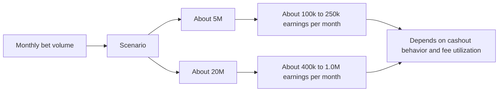
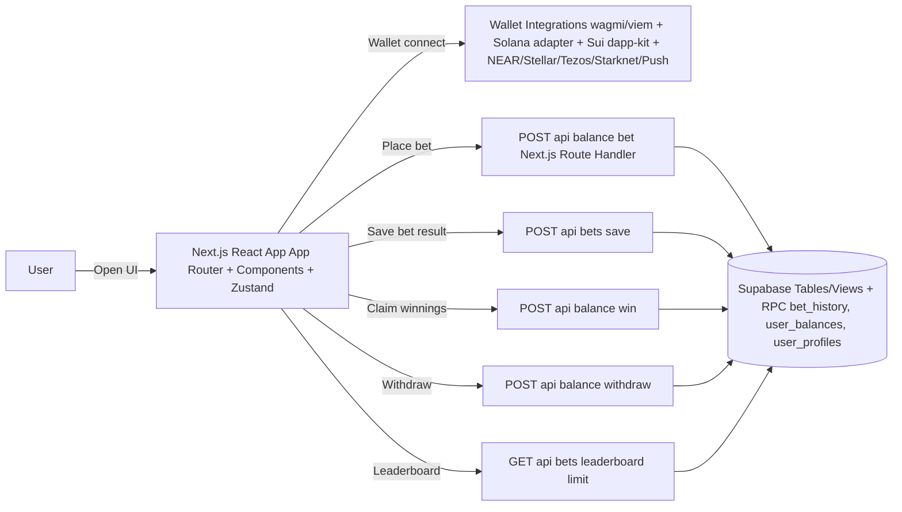
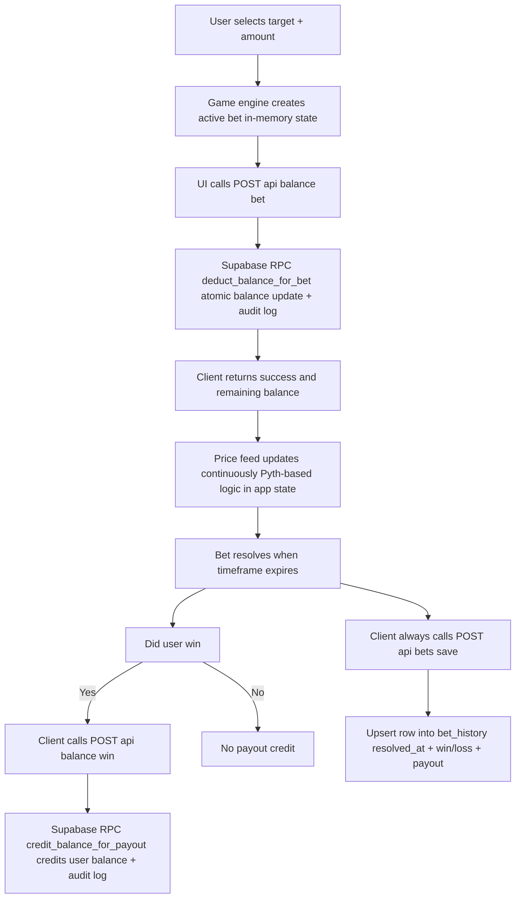
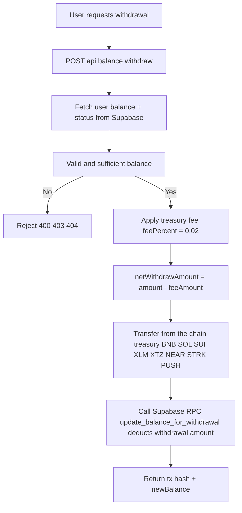
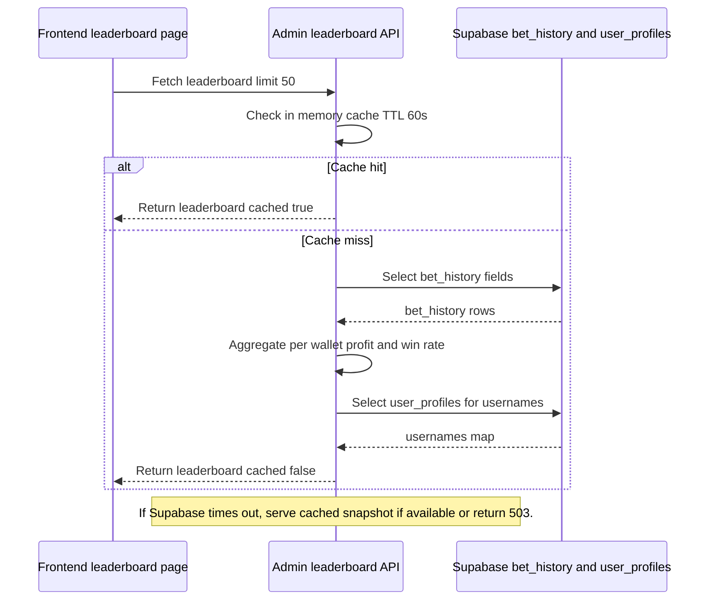

## Bynomo

The first binary options trading dapp on-chain.

---

## Overview

Bynomo delivers fast binary options trading with millisecond-resolution price feeds.
The product is inspired by the shortcomings of Web2 binary options apps (paper-mode bias, opaque settlement, and algorithmic manipulation),
and rebuilt for Web3 using real-time oracle pricing and a transparent, data-driven trading loop.

| Item | Link |
|---|---|
| Live link | https://bynomo.fun/ |
| X/Twitter | https://x.com/bynomofun |
| Demo video | https://youtu.be/pjFNfzP9laA |
| Telegram | https://t.me/bynomo |
| Discord | https://discord.gg/5MAHQpWZ7b |

Contact: bynomo.fun@gmail.com

---

## Story / Inspiration

in 2021, i saw an advertisement of a forex option trading app called binomo.
it was a mobile app and was promoted by a lot of big influencers.
one day i decided to use it in free mode which is paper trading mode.
within a week i made 10x the initial money.
then i decided to use the real mode and put 3 months of my income and lost it all.

later i realised on reddit that the company was running on algorithms, backdoors manipulators and completely fake making the user win in trial mode and lose in real mode.
This didn't happened only with me but 99% users that were using options trading platform and the entire reddit was flooded with it.

That day i decided to build a options trading platform to solve the problem of mine with other millions of traders.
but in web3 the <1s data feeds/ pyth oracles did not existed back then and it was impossible to build a high frequency options trading/ prediction dapp as the tools were limited.
but waited for 5 years and executed it this year 2026.

---

## The Problem

Today, Binary options trading in the Web3 world does not exist at all
And apps in the web2 world are broken, fraudulent and algorithmic baised.
Why?
- Coz there were no real time data oracles existed that can deliver price feeds in less than 1 second.
- We have 590 Million Crypto Users and 400 Million Txn happen EVERY SINGLE DAY on the top 200 blockchain.
- One Big News/ One Big Move/ One Big Crash ~ Oracle's Crash
This caused huge gap in the existence and reality for a high demand dapp like Bynomo

---

## The Solution

Solution - Bynomo
- Where every millisecond is tracked by pyth oracles to pull real time data
- Traders can Trade over 300+ Crypto, 100+ Stocks, 5+ Metals, 10+Forex, Commodities, Bonds every single thing on Real-time price chart
- Users can Bet unlimited times without signing txn
- Every user can trade binary options at lightning speed at 5s,10s,15s,30s,1m timeframes
- Infinite txns, no cap amounts and One Single Treasury
- Plan is to introduce 1-10x leverage, trade in open crypto markets freely
And Settlement in <0.001 ms
Like Binomo of Web2 but 10x better than any other dapp in existence.

---

## Key Features

1. Multi-chain wallet experience
   - Supports multiple networks/wallet integrations in one UI flow.

2. Oracle-driven pricing
   - Outcome resolution is tied to real-time price movement rather than opaque local simulation.

3. Instant feedback & short settlement windows
   - Trading feels like a round-based game with quick resolution.

4. Persistent bet history & public leaderboard
   - Leaderboard and user history are backed by Supabase.

5. Referral system
   - Referral codes and referral leaderboards are integrated into the product.

---

## Monetization

The platform makes money in two primary ways:

1. Withdrawal fees (treasury take-rate)
   - Withdrawal requests apply a treasury fee in `POST /api/balance/withdraw`.
   - The backend computes a fee percent and transfers only the net withdrawal amount.

2. House edge on bets
   - When a user places a bet, the system deducts the bet amount.
   - If the bet is won, the system credits `winAmount = bet.amount * multiplier`; otherwise, payout is zero.
   - The house edge is driven by the difference between total bet amounts lost and total payouts paid, plus the withdrawal take-rate.

Estimated earnings (best-effort):

| Monthly bet volume | Expected monthly earnings range | Notes |
|---|---|---|
| About $5M | About $100k to $250k per month | Based on withdrawal take rate plus house edge model assumptions |
| About $20M | About $400k to $1.0M per month | Depends on cashout behavior and effective fee utilization |



---

## Market Opportunity

| Segment | Market signal | Why it matters for Bynomo |
|---|---|---|
| Binary options / prediction | $27.56B (2025) → ~$116B by 2034 (19.8% CAGR) | Validates long-term demand for fast binary outcome trading |
| Crypto prediction markets | $45B+ annual volume (Polymarket, Kalshi, on-chain) | Shows liquidity appetite for oracle-driven prediction markets |
| Crypto derivatives volume | $86T+ annually (2025) | Indicates a large spec/trader base willing to move quickly |
| Crypto users | 590M+ worldwide | Large reachable audience for high-frequency “round” experiences |
| Bynomo positioning | Built for “fast rounds + verifiable oracle pricing + simple binary outcomes”, without Web2 trial-mode bias or settlement opacity | Defines the product wedge and differentiator |

---

## Competitive Landscape

| Segment | Examples | Limitation vs Bynomo |
|---|---|---|
| Web2 Binary Options | Binomo, IQ Option, Quotex | Often opaque settlement/pricing and can be biased in trial modes |
| Crypto Prediction Markets | Polymarket, Kalshi, Azuro | Outcomes typically resolve over minutes-to-hours, which feels slow for round-based high-frequency traders |
| Centralized Crypto Derivatives (CEX) | Binance Futures, Bybit, OKX | Powerful but complex (order types, funding, liquidation mechanics) vs a simple binary loop |
| On-chain Options / DeFi Primitives | Dopex, Lyra, Premia | More complex option mechanics and dependencies reduce “instant feedback” UX |
| Tap Trading (Derivatives) | Euphoria_fi | Mobile-first “Tap Trading” for options/perps-style speculation; may feel less like a dedicated fast binary outcomes loop |
| Multi-chain Wallet Trading UX | Wallet + dapp UIs across EVM/Solana/Sui/NEAR | UX fragmentation: users can’t get a unified, multi-chain binary experience in one place |

---

## Tech Stack

- Frontend
  - Next.js 16 (App Router) + React 19 + TypeScript
  - Tailwind CSS v4
  - Zustand (global state)
  - @tanstack/react-query
  - Web3/wallet integrations:
    - wagmi + viem (EVM)
    - Solana wallet-adapter stack
    - Sui dapp-kit
    - NEAR, Stellar, Tezos, Starknet, Push Chain

- Backend (within Next.js)
  - Next.js Route Handlers under `app/api/**`
  - Node.js runtime (Next/Vercel)

- Database / Services
  - Supabase (Postgres)
  - Supabase migrations in `supabase/migrations/**`
  - Auth/identity: Privy
  - Analytics: PostHog
  - Oracle pricing: Pyth Hermes client usage

- Testing
  - Jest + Testing Library + fast-check

- Linting
  - ESLint 9

---

## Local Development

### 1) Install dependencies

```bash
yarn install
```

### 2) Configure environment

Copy the example env file:

```bash
cp .env.example .env.local
```

Fill in required values in `.env.local` (RPC endpoints, Supabase URL/anon key, PostHog keys, and treasury secrets). Do not commit `.env.local`.

For a clean, grouped env setup guide (without secret values), see `docs/ENVIRONMENT.md`.

### 3) Run the dev server

```bash
yarn dev
```

The app should be available at:
http://localhost:3000

---

## Useful Commands

- Build: `yarn build`
- Lint: `yarn lint`
- Tests: `yarn test`

For contributing (setup, lint/tests, and PR expectations), see `docs/CONTRIBUTING.md`.

---

## Security Notes

- Treasury private keys are loaded via server environment variables (do not expose them to the client).
- The project includes protections against backend overload by caching and timeout behavior in critical endpoints (e.g., leaderboard provider).
- See `docs/SECURITY_REPORTING.md` for how to report security issues responsibly.

---

## Mermaid Diagrams

### 1) High-level architecture (client + API + Supabase)



### 2) Trade / bet lifecycle (bet placed -> resolve -> payout + persistence)



### 3) Withdrawal flow (treasury fee + on-chain/treasury transfer + balance update)



### 4) Leaderboard flow with caching + timeout guard



---

## ⚡Future

Endless possibilities: anything to everything related to P2P mode:
Stocks, Forex
Options
Derivatives
Futures
DEX

Ultimate Objective: To be the next PolyMarket for Binary Options Predictions

