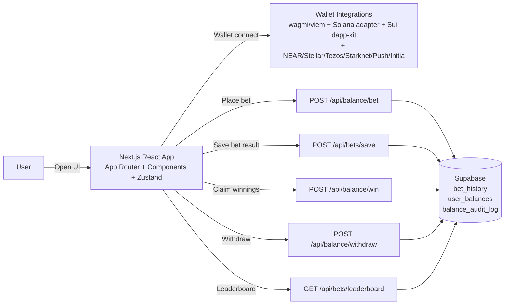
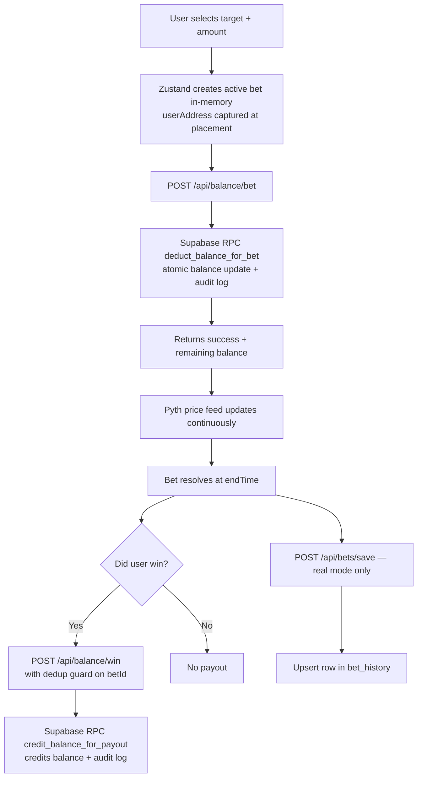
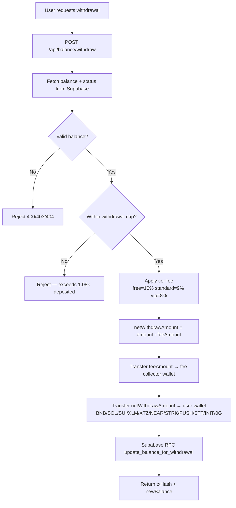

# Bynomo

> **The first binary options trading dapp on-chain.**  
> Fast binary rounds · Pyth oracle pricing · 12 blockchains · Transparent settlement

| | |
|---|---|
| **Live** | https://bynomo.fun/ |
| **Demo video** | https://youtu.be/t76ltZH9XSU |
| **X / Twitter** | https://x.com/bynomofun |
| **Telegram** | https://t.me/bynomo |
| **Discord** | https://discord.gg/5MAHQpWZ7b |
| **Contact** | bynomo.fun@gmail.com |

---

## Table of Contents

1. [Overview](#overview)
2. [Story & Inspiration](#story--inspiration)
3. [The Problem](#the-problem)
4. [The Solution](#the-solution)
5. [Game Modes](#game-modes)
6. [Supported Chains & Wallets](#supported-chains--wallets)
7. [Platform Features](#platform-features)
8. [Fee Structure](#fee-structure)
9. [Tech Stack](#tech-stack)
10. [Architecture](#architecture)
11. [Supabase Schema](#supabase-schema)
12. [API Reference](#api-reference)
13. [Admin Dashboard](#admin-dashboard)
14. [Directory Structure](#directory-structure)
15. [Environment Variables](#environment-variables)
16. [Local Development](#local-development)
17. [Deployment](#deployment)
18. [Monetization](#monetization)
19. [Market Opportunity](#market-opportunity)
20. [Competitive Landscape](#competitive-landscape)
21. [Roadmap](#roadmap)
22. [Security](#security)

---

## Overview

Bynomo delivers fast binary options trading with millisecond-resolution price feeds powered by **Pyth Hermes**. Users deposit native tokens into a per-chain treasury, receive an in-house balance, and trade binary rounds without signing a transaction on every bet. Settlement is fully deterministic and oracle-driven — no opaque algorithms, no trial-mode bias.

The product is live across **12 blockchains** and supports **300+ assets** (crypto, forex, stocks, metals, commodities).

---

## Story & Inspiration

In 2021, I saw an advertisement for a forex binary options app called Binomo. It was a mobile app promoted by big influencers. I tried the free (paper) mode and made 10× in a week. Then I put in three months of my savings in real mode — and lost it all.

Later I found Reddit threads showing that Binomo ran on algorithms that let users win in trial mode and lose in real mode. This happened to millions of traders worldwide.

That day I decided to build a transparent, oracle-driven binary options platform. But in 2021, sub-1-second price feeds didn't exist in Web3. I waited five years, and in 2026 the tools were finally ready. **Bynomo** is the result.

---

## The Problem

- Binary options trading in Web3 doesn't exist at a production level.
- Web2 platforms (Binomo, IQ Option) are opaque, algorithmically biased, and fraudulent.
- There were no real-time data oracles that could deliver price feeds in under 1 second — until Pyth Hermes.
- 590 million crypto users and 400 million daily transactions create a massive latent demand.
- One big market move → oracle crash → no fast-settlement dapp can function.

---

## The Solution

Bynomo solves all of this:

- **Pyth Hermes** delivers sub-1-second price feeds across 300+ assets.
- **Binary rounds** at 5s / 10s / 15s / 30s / 1m timeframes — no wallet signature per bet.
- **One single treasury** per chain — infinite bets, no cap, instant house balance settlement.
- **Fully on-chain verifiable** — every deposit, withdrawal, and payout is logged immutably.
- **12 blockchains** in a single unified UI.

---

## Game Modes

### Classic Mode (Binomo-style)

The foundational mode. Players pick a direction (**UP** or **DOWN**), a multiplier target, and a duration.

- **Strike price** = Pyth feed price at bet time
- **Settlement** = price at `endTime` vs strike
- **Win condition:** price > strike for UP; price < strike for DOWN
- **Timeframes:** 5s, 10s, 15s, 30s, 1m
- **Multipliers:** configurable grid targets (e.g. 1.9×, 2.0×, 2.5×)

### Box Mode

Players choose a pre-drawn **price band** (box) from the grid and a time window.

- **Win condition:** Pyth price is **inside** `[priceBottom, priceTop]` at `endTime`
- Higher risk = tighter box = larger multiplier

### Draw Mode

Players **draw a rectangle** directly on the live chart to define their own price band and time window.

- Minimum box size and minimum future start time enforced
- **Dynamic multiplier** — calculated from box size, distance from current price, and duration
- Smaller / further / shorter = higher payout
- **Win condition:** price is inside the drawn band at the drawn end time

### Blitz Mode

A time-limited overlay that boosts all multipliers by **2×**.

- **Schedule:** 1 minute active, 2 minutes cooldown — repeating cycle
- **Entry fee:** one-time per-chain on-chain payment sent directly to the platform fee collector wallet (not the game treasury)
- **Entry fees by chain:** BNB 0.1 · SOL 1 · SUI 50 · XLM 400 · XTZ 150 · NEAR 50 · STRK 1,500 · Testnets 0.01
- Once paid, `hasBlitzAccess` is active for the current blitz window

### Demo Mode

Full simulation with no real funds. Demo bets are prefixed `demo-*`, excluded from Supabase persistence, and tracked separately in admin analytics.

---

## Supported Chains & Wallets

| Chain | Token | Wallet(s) | Type |
|-------|-------|-----------|------|
| **BNB Chain** | BNB | MetaMask, Trust, WalletConnect (via wagmi + ConnectKit), Privy | Mainnet |
| **Solana** | SOL, BYNOMO | Phantom, Backpack, Solflare, any wallet-adapter wallet | Mainnet |
| **Sui** | SUI (native), USDC | Sui Wallet, BlueMove, any Mysten dapp-kit wallet | Mainnet |
| **OneChain** | OCT | Sui Wallet, BlueMove (Sui-compatible) | Mainnet |
| **NEAR** | NEAR | MyNearWallet, HereWallet, Bitget Wallet | Mainnet |
| **Stellar** | XLM | Freighter, Lobster, Trezor (via Stellar Wallets Kit) | Mainnet |
| **Tezos** | XTZ | Temple, Kukai (Taquito BeaconWallet) | Mainnet |
| **Starknet** | STRK | Argent X, Braavos (injected `window.starknet`) | Mainnet |
| **Initia** | INIT | Initia Wallet (InterwovenKit) | Mainnet |
| **0G Mainnet** | 0G | MetaMask, Trust, any EVM wallet | Mainnet |
| **Push Chain** | PC | MetaMask, Trust, any EVM wallet | Testnet |
| **Somnia** | STT | MetaMask, Trust, any EVM wallet | Testnet |

**Social login:** Google, Twitter, Email via **Privy** (creates embedded EVM wallet on BSC).

**Connect Wallet order:** Solana → BNB → OneChain → Sui → NEAR → Starknet → Stellar → Tezos → 0G → Push → Initia → Somnia → Social Login

---

## Platform Features

### Deposits
- User sends native tokens on-chain to the treasury wallet
- Server verifies the transaction (EVM/Initia chains verify on-chain; SOL/SUI/XLM/XTZ/NEAR/STRK verified by tx hash)
- Platform fee deducted; **net** amount credited to `user_balances` in Supabase via `update_balance_for_deposit` RPC
- Fee logged as `platform_fee` in `balance_audit_log`

### Withdrawals
- User requests withdrawal amount ≤ their available balance
- **Signed intent** required for EVM-like chains (BNB, PUSH, SOMNIA, 0G) — prevents replay attacks
- **Withdrawal cap:** max `total_deposited × 1.08` on mainnet chains (prevents profit extraction on tiny deposits)
- After `FREQUENCY_REVIEW_THRESHOLD` withdrawals, routed to manual review queue (`withdrawal_requests`)
- Platform fee deducted; treasury sends **net** amount on-chain; Supabase balance updated

### Balance System
- Every wallet has one row per currency in `user_balances`
- All bet deductions and win credits happen atomically via Supabase RPCs
- Full audit trail in `balance_audit_log` with `operation_type`: `deposit`, `withdrawal`, `bet_placed`, `bet_won`, `platform_fee`, `admin_balance_wipe`

### Player Tiers
| Tier | Deposit/Withdrawal Fee |
|------|----------------------|
| `free` | 10% |
| `standard` | 9% |
| `vip` | 8% |

### Referrals
- Every user gets a referral code
- Referrer earns credit when referee deposits; tracked in `user_referrals`
- Admin dashboard shows referral leaderboard

### Access Codes
- Invite-only onboarding via access codes stored in `access_codes` table
- Admin can generate batches and export CSV

### Waitlist
- Email capture at `/waitlist`
- Admin dashboard shows full list

### Public Live Stats
- `GET /api/stats/public` serves aggregate stats (total bets, volume, payouts, win rate, unique wallets)
- Displayed on the landing page in `LiveStatsSection` with animated counters

### Session Tracking
- `POST /api/session/ping` keeps dwell-time alive
- `DELETE /api/session/ping` ends session
- Stored in `user_sessions` for admin Wallet Intel

### Leaderboard
- `GET /api/bets/leaderboard` — aggregated per-wallet profit + win rate
- 60s in-memory cache; 503 fallback to cached snapshot on timeout

### Deduplication & Race Condition Prevention
- `bet_id` checked against `balance_audit_log` before each payout — duplicate credits blocked server-side
- Client-side: `resolveBet` in Zustand removes the bet from `activeBets` synchronously before any async API call
- `userAddress` captured at bet placement time so settlement works even if wallet disconnects mid-round

### Ban System
- Admin can globally ban a wallet address
- Banned wallets cannot deposit, withdraw, or bet
- **Unban action:** removes ban AND zeroes all balances in `user_balances` — player starts completely fresh
- All balance wipes logged in `balance_audit_log` as `admin_balance_wipe`

---

## Fee Structure

### Platform Fees (Deposit & Withdrawal)

Applied as a percentage of the gross amount. Fee is transferred from the treasury to the platform fee collector wallet (`NEXT_PUBLIC_PLATFORM_FEE_WALLET_*`).

| Tier | Fee |
|------|-----|
| free | 10% |
| standard | 9% |
| vip | 8% |

The net amount (after fee) is what's credited or sent on withdrawal.

### Blitz Entry Fees (per-chain, flat native amount)

Paid once per blitz window directly to the platform fee collector wallet.

| Chain | Fee |
|-------|-----|
| BNB | 0.1 BNB |
| SOL | 1 SOL |
| SUI | 50 SUI (native) |
| XLM | 400 XLM |
| XTZ | 150 XTZ |
| NEAR | 50 NEAR |
| STRK | 1,500 STRK |
| Testnets (PUSH/STT/0G/OCT/INIT) | 0.01 native |

### House Edge

- Bet multipliers are set below fair-odds parity
- Break-even user win rate at 1.9× multiplier = **52.6%**
- Rates above 52.6% mean the house loses on that mode (tracked in the Game Mode P&L admin panel)

---

## Tech Stack

### Frontend
- **Next.js 16.1.3** (App Router, Turbopack)
- **React 19.2.3** + **TypeScript 5**
- **Tailwind CSS v4**
- **Zustand 5** (global state — 6 slices)
- **TanStack React Query 5**
- **Framer Motion** (animations)
- **Recharts** + **d3-scale** / **d3-shape** (charts)
- **Three.js / OGL** (landing page visuals)
- **Lucide React** (icons)

### Web3 / Wallet
- **wagmi 3 + viem 2 + ConnectKit** — EVM (BSC, Push donut, Somnia, 0G)
- **Privy** (`@privy-io/react-auth`) — social login + embedded EVM wallet
- **Solana wallet-adapter** (`@solana/web3.js`, `@solana/spl-token`)
- **Sui dapp-kit** (`@mysten/dapp-kit`, `@mysten/sui`)
- **NEAR wallet-selector** (`near-api-js`, `@near-js/*`)
- **Stellar Wallets Kit** (`@creit.tech/stellar-wallets-kit`, `@stellar/stellar-sdk`)
- **Taquito** (`@taquito/taquito`, `@airgap/beacon-sdk`) — Tezos
- **Starknet.js** — Starknet
- **InterwovenKit** (`@initia/interwovenkit-react`) — Initia

### Backend (Next.js Route Handlers)
- **Node.js runtime** via Vercel serverless functions
- **Supabase** (`@supabase/supabase-js`) — Postgres + RPC functions
- **Pyth Hermes** (`@pythnetwork/hermes-client`) — price feeds
- **ethers 6** — EVM tx signing (treasury)
- **PostHog** (`posthog-js`, `posthog-node`) — analytics

### Tooling
- **ESLint 9** + `eslint-config-next`
- **Jest 30** + Testing Library + fast-check
- **Hardhat 3** + ts-node (smart contracts)
- **Vercel Analytics + Speed Insights**

---

## Architecture

### State Management (Zustand — `lib/store/`)

| Slice | Responsibility |
|-------|---------------|
| `walletSlice` | Address, network, account type (real/demo), currency, connect/disconnect |
| `gameSlice` | Game mode, active/settled bets, Pyth price feed, Blitz state, bet placement/resolution |
| `balanceSlice` | House balance, deposit/withdraw, demo balance |
| `historySlice` | Local bet history persistence |
| `referralSlice` | Referral code sync |
| `profileSlice` | Username / profile fetch |

All slices are combined into `useOverflowStore` in `lib/store/index.ts`.

### Mermaid Diagrams

#### High-level architecture



#### Bet lifecycle



#### Withdrawal flow



---

## Supabase Schema

### Tables

| Table | Purpose |
|-------|---------|
| `user_balances` | PK `(user_address, currency)` — balance, tier, status |
| `balance_audit_log` | Every balance event: deposit, withdrawal, bet_placed, bet_won, platform_fee, admin_balance_wipe |
| `bet_history` | Settled bets: asset, direction, amount, payout, won, mode, network |
| `user_profiles` | Username, access_code |
| `user_referrals` | referral_code, referred_by, referral_count |
| `access_codes` | Invite codes + usage |
| `waitlist` | Email capture |
| `banned_wallets` | Global bans + `is_wallet_globally_banned()` helper |
| `user_sessions` | Dwell time / ping tracking |
| `withdrawal_requests` | Manual approval queue |

### RPC Functions

| Function | Purpose |
|----------|---------|
| `update_balance_for_deposit` | Atomic deposit credit + audit log |
| `deduct_balance_for_bet` | Atomic bet deduction + audit log |
| `credit_balance_for_payout` | Atomic win credit + audit log |
| `update_balance_for_withdrawal` | Atomic withdrawal deduction + audit log |
| `increment_referral_count` | Atomic referral counter |

RLS is enforced via migration `004_enable_rls.sql`. All writes from the app use the **service role key** server-side — the anon key is read-only for the client.

Migrations live in `supabase/migrations/`.

---

## API Reference

### Balance

| Method | Route | Purpose |
|--------|-------|---------|
| `GET` | `/api/balance/[address]` | Fetch all balances for a wallet |
| `POST` | `/api/balance/deposit` | Record deposit, deduct fee, credit net to house balance |
| `POST` | `/api/balance/withdraw` | Execute withdrawal, deduct fee, send net on-chain |
| `POST` | `/api/balance/bet` | Deduct bet amount from house balance |
| `POST` | `/api/balance/win` | Credit win payout (with dedup guard) |
| `POST` | `/api/balance/payout` | Alternate payout path |

### Bets

| Method | Route | Purpose |
|--------|-------|---------|
| `POST` | `/api/bets/save` | Upsert resolved bet into `bet_history` |
| `GET` | `/api/bets/history` | User's bet history |
| `GET` | `/api/bets/leaderboard` | Aggregated leaderboard (60s cached) |

### User

| Method | Route | Purpose |
|--------|-------|---------|
| `GET/POST` | `/api/referral` | Fetch/register referral |
| `POST` | `/api/validate-access-code` | Validate invite code |
| `POST/DELETE` | `/api/session/ping` | Session tracking start/end |
| `GET` | `/api/withdrawals` | User's withdrawal request history |
| `GET` | `/api/initia/balance` | Initia chain balance helper |

### Public Stats

| Method | Route | Purpose |
|--------|-------|---------|
| `GET` | `/api/stats/public` | Aggregate platform stats (revalidate 300s) |

### Admin

| Method | Route | Purpose |
|--------|-------|---------|
| `POST` | `/api/admin/auth` | Admin login |
| `POST` | `/api/admin/logout` | Admin logout |
| `GET` | `/api/admin/stats` | Dashboard stats (real/demo split) |
| `GET` | `/api/admin/mode-analytics` | Per-game-mode P&L |
| `GET` | `/api/admin/player-ledger` | Per-wallet financial summary |
| `GET` | `/api/admin/users` | User list for ledger |
| `POST` | `/api/admin/users/status` | Update user status (active/frozen/banned) |
| `GET` | `/api/admin/transactions` | Deposit/withdrawal audit stream |
| `GET` | `/api/admin/game-history` | Raw bet history rows |
| `GET` | `/api/admin/treasury-balances` | On-chain treasury balances + USD estimates |
| `GET` | `/api/admin/wallet-insights` | Deep wallet analytics |
| `GET/POST/DELETE` | `/api/admin/banned-wallets` | List/add/remove global bans |
| `POST` | `/api/admin/unban-wallet` | Unban + zero balance (fresh start) |
| `GET` | `/api/admin/currencies` | Market/asset config |
| `GET` | `/api/admin/waitlist` | Waitlist email list |
| `GET/POST` | `/api/admin/access-codes` | List/generate invite codes |
| `GET` | `/api/admin/withdrawal-requests/pending` | Manual withdrawal queue |
| `POST` | `/api/admin/withdrawal-requests/[id]/accept` | Approve + execute withdrawal |
| `POST` | `/api/admin/withdrawal-requests/[id]/reject` | Reject withdrawal request |
| `GET` | `/api/admin/danger-zone` | Sensitive admin ops |

---

## Admin Dashboard

Located at `/dashboard`. Protected by admin auth (`requireAdminAuth`).

| Tab | What it shows |
|-----|--------------|
| **Wallet Intel** | Look up any address — balances, audit log, bet history, withdrawals, ban status, session dwell time, explorer links |
| **Ledger** | All users: identity, currency, liquidity |
| **Player P&L** | Per-wallet: deposited / withdrawn / available balance / net P&L / bets / fees paid / sortable / **Unban button** for banned wallets |
| **Gameplay** | Game Mode P&L panel (Classic/Box/Draw — win rate, house P&L, by-chain breakdown, top assets) + full bet history with Real/Demo/Chain filters |
| **Financials** | Deposit/withdrawal stream; pending withdrawal queue with Accept/Reject |
| **Inventory** | Pyth-fed market asset list |
| **Referrals** | Referral leaderboard and stats |
| **Waitlist** | Email capture list |
| **Access Codes** | Generate batch, view usage, export CSV |
| **Danger Zone** | High-risk admin operations |

### Player P&L — Unban Flow

When you click **↑ Unban** on a banned player row:
1. Removes the wallet from `banned_wallets`
2. Sets `user_balances.balance = 0` across all currencies via Supabase `UPDATE` — effective immediately everywhere in the system
3. Sets `status = 'active'` — deposits and bets re-enabled
4. Writes an `admin_balance_wipe` entry to `balance_audit_log` for full audit trail
5. Table auto-refreshes

---

## Directory Structure

```
Bynomo-main/
├── app/                        # Next.js App Router
│   ├── page.tsx                # Landing page
│   ├── trade/                  # Main game UI
│   ├── dashboard/              # Admin dashboard
│   ├── leaderboard/            # Public leaderboard
│   ├── profile/                # User profile
│   ├── referrals/              # Referral page
│   ├── waitlist/               # Waitlist signup
│   ├── withdrawals/            # Withdrawal history
│   ├── litepaper/              # Litepaper
│   ├── api/                    # All API route handlers
│   └── providers.tsx           # Wallet + query providers
│
├── components/
│   ├── game/                   # GameBoard, LiveChart, TierStatusModal
│   ├── wallet/                 # WalletConnectModal, WalletDiscoveryModal
│   ├── balance/                # DepositModal, WithdrawModal
│   ├── landing/                # LiveStatsSection, DemoVideoSection, AdvisorsRevealSection, etc.
│   └── ui/                     # Shared UI primitives
│
├── lib/
│   ├── store/                  # Zustand slices (wallet, game, balance, history, referral, profile)
│   ├── fees/                   # platformFee.ts — tier fees + blitz fee logic
│   ├── bans/                   # walletBan.ts — global ban helpers
│   ├── admin/                  # computeStats.ts, requireAdminAuth, walletAddressVariants
│   ├── supabase/               # serviceClient, browserClient
│   ├── bnb/                    # BNB/EVM client + wagmi config
│   ├── solana/                 # Solana client + backend-client
│   ├── sui/                    # Sui client + backend-client
│   ├── near/                   # NEAR wallet + config
│   ├── stellar/                # Stellar backend-client
│   ├── tezos/                  # Tezos client
│   ├── starknet/               # Starknet wallet + backend-client
│   ├── push/                   # Push Chain client
│   ├── somnia/                 # Somnia client
│   ├── zg/                     # 0G backend-client
│   ├── onechain/               # OneChain client
│   ├── initia/                 # Initia client
│   ├── utils/                  # priceFeed, address utils
│   └── logging/                # error-logger
│
├── hooks/                      # useSessionTracker, etc.
├── types/                      # Shared TypeScript types
├── public/                     # Static assets (logos, images)
├── supabase/                   # migrations/, scripts/, tests
├── contracts/                  # Solidity / Hardhat project
├── scripts/                    # Ops scripts (balance sync, reconcile)
└── docs/                       # ENVIRONMENT.md, CONTRIBUTING.md, SECURITY_REPORTING.md
```

---

## Environment Variables

Copy `.env.example` to `.env` and fill in values. See `docs/ENVIRONMENT.md` for the full guide.

### Core
```env
NEXT_PUBLIC_APP_NAME=
NEXT_PUBLIC_ROUND_DURATION=
NEXT_PUBLIC_PRICE_UPDATE_INTERVAL=
NEXT_PUBLIC_CHART_TIME_WINDOW=
```

### Supabase
```env
NEXT_PUBLIC_SUPABASE_URL=
NEXT_PUBLIC_SUPABASE_ANON_KEY=
SUPABASE_SERVICE_KEY=
```

### Privy (social login)
```env
NEXT_PUBLIC_PRIVY_APP_ID=
PRIVY_APP_SECRET=
```

### Admin
```env
ADMIN_PASSWORD=
```

### EVM / BNB
```env
NEXT_PUBLIC_TREASURY_ADDRESS=
NEXT_PUBLIC_BNB_NETWORK=
NEXT_PUBLIC_BNB_RPC_ENDPOINT=
BNB_TREASURY_SECRET_KEY=
NEXT_PUBLIC_WALLETCONNECT_PROJECT_ID=
```

### Solana
```env
NEXT_PUBLIC_SOLANA_NETWORK=
NEXT_PUBLIC_SOL_TREASURY_ADDRESS=
SOL_TREASURY_SECRET_KEY=
```

### Sui
```env
NEXT_PUBLIC_SUI_NETWORK=
NEXT_PUBLIC_SUI_RPC_ENDPOINT=
NEXT_PUBLIC_SUI_TREASURY_ADDRESS=
SUI_TREASURY_SECRET_KEY=
NEXT_PUBLIC_USDC_TYPE=
```

### Stellar
```env
NEXT_PUBLIC_STELLAR_NETWORK=
NEXT_PUBLIC_STELLAR_HORIZON_URL=
NEXT_PUBLIC_STELLAR_TREASURY_ADDRESS=
STELLAR_TREASURY_SECRET=
```

### Tezos
```env
NEXT_PUBLIC_TEZOS_RPC_URL=
NEXT_PUBLIC_TEZOS_TREASURY_ADDRESS=
TEZOS_TREASURY_SECRET_KEY=
```

### NEAR
```env
NEXT_PUBLIC_NEAR_TREASURY_ADDRESS=
NEAR_TREASURY_ACCOUNT_ID=
NEAR_TREASURY_PRIVATE_KEY=
```

### Starknet
```env
NEXT_PUBLIC_STARKNET_TREASURY_ADDRESS=
NEXT_PUBLIC_STARKNET_RPC_URL=
NEXT_PUBLIC_STARKNET_CHAIN_ID=
STARKNET_TREASURY_PRIVATE_KEY=
STARKNET_TREASURY_CAIRO_VERSION=
```

### Push Chain
```env
NEXT_PUBLIC_PUSH_RPC_ENDPOINT=
NEXT_PUBLIC_PUSH_TREASURY_ADDRESS=
PUSH_TREASURY_SECRET_KEY=
```

### Somnia
```env
NEXT_PUBLIC_SOMNIA_TESTNET_RPC=
NEXT_PUBLIC_SOMNIA_TREASURY_ADDRESS=
SOMNIA_TREASURY_SECRET_KEY=
```

### 0G Mainnet
```env
NEXT_PUBLIC_ZG_MAINNET_RPC=
NEXT_PUBLIC_ZG_TREASURY_ADDRESS=
ZG_TREASURY_SECRET_KEY=
```

### Initia
```env
NEXT_PUBLIC_INITIA_RPC_URL=
NEXT_PUBLIC_INITIA_TREASURY_ADDRESS=
```

### Platform Fee Collector Wallets
```env
NEXT_PUBLIC_PLATFORM_FEE_WALLET_EVM=
NEXT_PUBLIC_PLATFORM_FEE_WALLET_SOL=
NEXT_PUBLIC_PLATFORM_FEE_WALLET_SUI=
NEXT_PUBLIC_PLATFORM_FEE_WALLET_XLM=
NEXT_PUBLIC_PLATFORM_FEE_WALLET_XTZ=
NEXT_PUBLIC_PLATFORM_FEE_WALLET_NEAR=
NEXT_PUBLIC_PLATFORM_FEE_WALLET_STRK=
```

### Analytics
```env
NEXT_PUBLIC_POSTHOG_KEY=
NEXT_PUBLIC_POSTHOG_HOST=
```

---

## Local Development

### 1. Install dependencies

```bash
yarn install
```

### 2. Configure environment

```bash
cp .env.example .env
# Fill in required values
```

### 3. Run Supabase migrations

```bash
# Apply migrations to your Supabase project via the dashboard or CLI
supabase db push
```

### 4. Start the dev server

```bash
yarn dev
```

App runs at `http://localhost:3000`.

### Useful Commands

```bash
yarn build    # Production build
yarn lint     # ESLint
yarn test     # Jest test suite
```

See `docs/CONTRIBUTING.md` for PR expectations and code standards.

---

## Deployment

Deployed on **Vercel** (Next.js App Router). 

- `next.config.ts` sets CSP headers, `X-Frame-Options`, COOP, and CORS for `/api/*` routes
- TypeScript `ignoreBuildErrors: false` — all type errors block deploy
- Turbopack enabled for dev builds
- Environment variables set in Vercel Dashboard → Settings → Environment Variables

---

## Monetization

The platform earns in three ways:

### 1. Platform Fees (Deposit + Withdrawal)
10% / 9% / 8% of every on-chain deposit and withdrawal depending on user tier. Fee is transferred from the treasury to the platform fee collector wallet on every transaction.

### 2. House Edge on Bets
Multipliers are set below fair-odds parity. At a 1.9× multiplier, break-even is 52.6% win rate. Modes where users win at higher rates are identified in the Game Mode P&L admin panel.

### 3. Blitz Entry Fees
One-time per-window flat fees paid directly to the fee collector wallet on each chain.

### Revenue Projections

| Monthly bet volume | Expected monthly earnings |
|-------------------|--------------------------|
| ~$5M | $100k – $250k |
| ~$20M | $400k – $1.0M |

*Based on withdrawal take-rate + house edge assumptions.*

---

## Market Opportunity

| Segment | Signal | Why it matters |
|---------|--------|----------------|
| Binary options / prediction | $27.56B (2025) → ~$116B by 2034 (19.8% CAGR) | Long-term demand for fast binary outcome trading |
| Crypto prediction markets | $45B+ annual volume (Polymarket, Kalshi) | Liquidity appetite for oracle-driven prediction markets |
| Crypto derivatives volume | $86T+ annually (2025) | Large speculative trader base |
| Crypto users | 590M+ worldwide | Large reachable audience |
| Bynomo positioning | Fast rounds + verifiable oracle pricing + simple binary outcomes | Clear product wedge vs Web2 and DeFi alternatives |

---

## Competitive Landscape

| Category | Examples | Limitation vs Bynomo |
|----------|----------|---------------------|
| Web2 Binary Options | Binomo, IQ Option, Quotex | Opaque settlement, algorithmic bias, trial-mode manipulation |
| Crypto Prediction Markets | Polymarket, Kalshi, Azuro | Minutes-to-hours resolution — too slow for fast rounds |
| CEX Derivatives | Binance Futures, Bybit, OKX | Complex mechanics — funding, liquidation, order types |
| On-chain Options | Dopex, Lyra, Premia | Complex option mechanics, no instant UX |
| Tap Trading | Euphoria_fi | Mobile-first perps, not a dedicated fast binary loop |
| Multi-chain wallets | Various | UX fragmentation — no unified multi-chain binary experience |

---

## Roadmap

### Phase 0 — Stability & Hardening ✅
- Core reliability on `/trade`
- Admin dashboard + analytics
- Multi-chain deposit/withdrawal
- Fee system + audit trail
- Ban/unban system with balance wipe

### Phase 1 — Controlled Beta
- Limited user cohort
- Monitor: price feed timeouts, settlement correctness, withdrawal success rate
- Tighten incident response loop

### Phase 2 — Public Launch
- Open access progressively after beta thresholds
- Scale APIs and observability
- Community growth: X/Twitter, Telegram, Discord, referral campaigns

### Phase 3 — Chain Expansion
- Add chains incrementally (one at a time)
- Deposit/withdraw reconciliation per new chain
- Maintain consistent security and payout standards

### Product Roadmap

- **P2P Mode** — shift Classic from P2T (person-to-treasury) to P2P to reduce house risk
- **200+ new assets** — more crypto, forex, stocks, commodities via Pyth
- **Leverage 1–100×** *(optional)*
- **Trader profiles** — highest P&L, most accurate, biggest risk taker
- **Tournaments** *(optional)*
- **Social trading** — follow traders, copy trades, leaderboards *(optional)*
- **Mobile-first redesign**
- **Top 50 chain expansion** *(subject to adoption checks)*

### Launch Gates (per phase)
- 0 critical security findings open
- Build and TypeScript checks passing
- Settlement and balance invariants verified
- Incident playbook and rollback path confirmed

---

## Security

- Treasury private keys are **server-side only** — never exposed to the client
- Signed withdrawal intents required for EVM chains (replay protection)
- Withdrawal cap enforced: max `total_deposited × 1.08`
- Duplicate payout prevention: server-side dedup guard on `betId` in `balance_audit_log`
- RLS enabled on Supabase — anon key is read-only; all writes use service role key
- Admin routes protected by `requireAdminAuth` middleware
- CSP + security headers set in `next.config.ts`

To report a security issue: see `docs/SECURITY_REPORTING.md` or email bynomo.fun@gmail.com

---

## Future

Bynomo's ultimate objective is to become the **PolyMarket for Binary Options** — a transparent, fast, multi-chain prediction platform for everything:

- Stocks · Forex · Options · Derivatives · Futures · DEX integration

> *Like Binomo of Web2, but 10× better and fully on-chain.*
