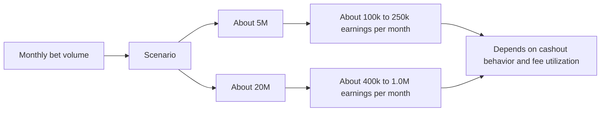
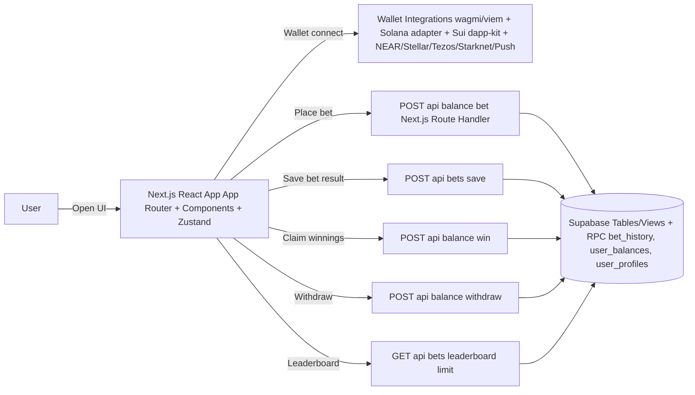
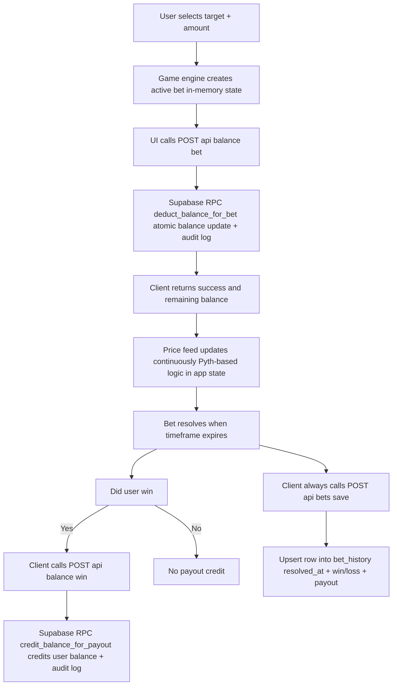
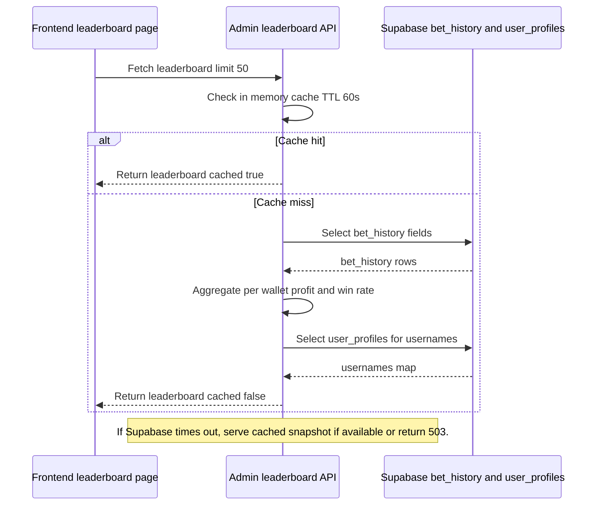
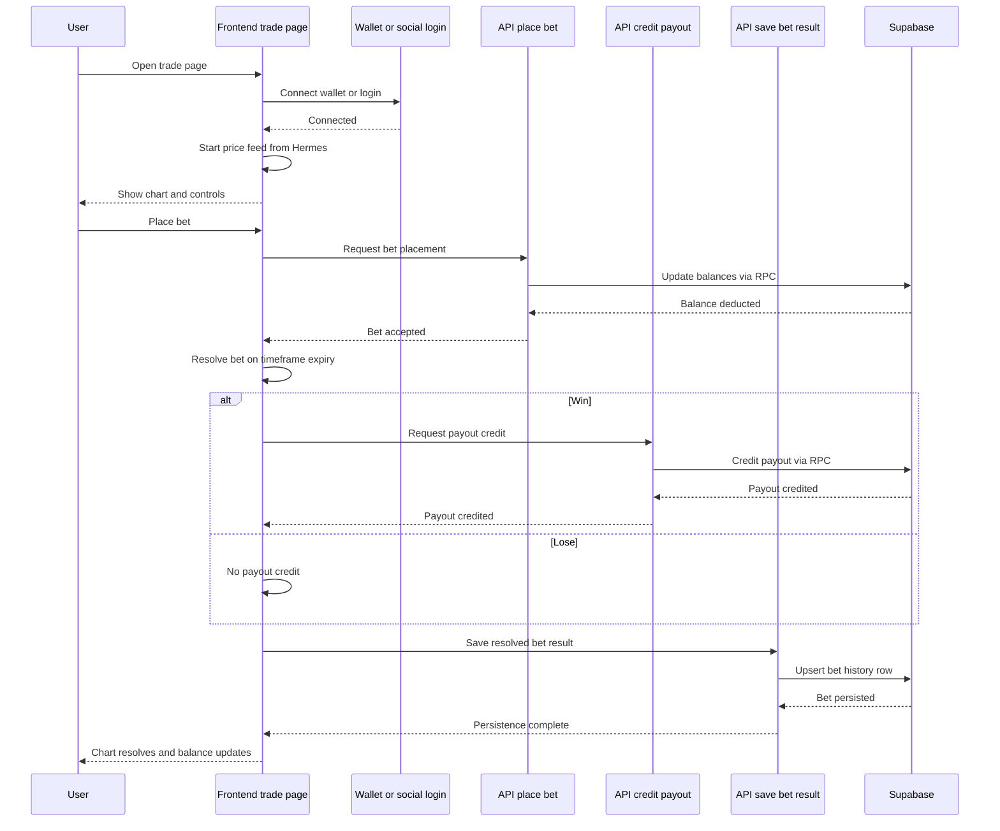

## Bynomo

The first binary options trading dapp on-chain.

---

## Overview

Bynomo delivers fast binary options trading with millisecond-resolution price feeds.
The product is inspired by the shortcomings of Web2 binary options apps (paper-mode bias, opaque settlement, and algorithmic manipulation),
and rebuilt for Web3 using real-time oracle pricing and a transparent, data-driven trading loop.

| Item | Link |
|---|---|
| Live link | https://bynomo.fun/ |
| X/Twitter | https://x.com/bynomofun |
| Demo video | https://youtu.be/9jluc7bjvG4|
| Telegram | https://t.me/bynomo |
| Discord | https://discord.gg/5MAHQpWZ7b |

Contact: bynomo.fun@gmail.com / amaansayyad2001@gmail.com

---

## Realtime Confirmations

Bynomo supports realtime balance/trade UX updates driven by backend and on-chain events.

- Realtime event subscriptions for confirmation feedback
- Immediate UI balance refresh after deposit/withdraw confirmation
- Explorer-linked success toasts for verifiable transactions

---

## Story / Inspiration

In 2021, I saw an advertisement of a forex option trading app called binomo. It was a mobile app and was promoted by a lot of big influencers.

One day I decided to use it in free mode, which is paper trading mode. Within a week, I made 10x the initial money.

Then I decided to use the real mode and put 3 months of my income, and lost it all.

Later I realised on Reddit that the company was running on algorithms, backdoors manipulators, and completely fake, making the user win in trial mode and lose in real mode.
This didn't happen only with me; 99% users that were using options trading platform, and the entire Reddit was flooded with it.

That day I decided to build an options trading platform to solve the problem of mine with other millions of traders, but in Web3 the <1s data feeds/ Pyth oracles did not exist back then, and it was impossible to build a high-frequency options trading/ prediction dapp as the tools were limited.
But waited for 5 years and executed it this year, 2026.

---

## The Problem

Today, Binary options trading in the Web3 world does not exist at all
And apps in the web2 world are broken, fraudulent and algorithmic baised.
Why?
- Coz there were no real time data oracles existed that can deliver price feeds in less than 1 second.
- We have 590 Million Crypto Users and 400 Million Txn happen EVERY SINGLE DAY on the top 200 blockchain.
- One Big News/ One Big Move/ One Big Crash ~ Oracle's Crash
This caused huge gap in the existence and reality for a high demand dapp like Bynomo

---

## The Solution

Solution - Bynomo
- Where every millisecond is tracked by pyth oracles to pull real time data
- Traders can Trade over 300+ Crypto, 100+ Stocks, 5+ Metals, 10+Forex, Commodities, Bonds every single thing on Real-time price chart
- Users can Bet unlimited times without signing txn
- Every user can trade binary options at lightning speed at 5s,10s,15s,30s,1m timeframes
- Infinite txns, no cap amounts and One Single Treasury
- Plan is to introduce 1-10x leverage, trade in open crypto markets freely
And Settlement in <0.001 ms
Like Binomo of Web2 but 10x better than any other dapp in existence.

---

## Key Features

1. Multi-chain wallet experience
   - Supports multiple networks/wallet integrations in one UI flow.

2. Oracle-driven pricing
   - Outcome resolution is tied to real-time price movement rather than opaque local simulation.

3. Instant feedback & short settlement windows
   - Trading feels like a round-based game with quick resolution.

4. Persistent bet history & public leaderboard
   - Leaderboard and user history are backed by Supabase.

5. Referral system
   - Referral codes and referral leaderboards are integrated into the product.

---

## Monetization

The platform makes money in two primary ways:

1. Withdrawal fees (treasury take-rate)
   - Withdrawal requests apply a treasury fee in `POST /api/balance/withdraw`.
   - The backend computes a fee percent and transfers only the net withdrawal amount.

2. House edge on bets
   - When a user places a bet, the system deducts the bet amount.
   - If the bet is won, the system credits `winAmount = bet.amount * multiplier`; otherwise, payout is zero.
   - The house edge is driven by the difference between total bet amounts lost and total payouts paid, plus the withdrawal take-rate.

Estimated earnings (best-effort):

| Monthly bet volume | Expected monthly earnings range | Notes |
|---|---|---|
| About $5M | About $100k to $250k per month | Based on withdrawal take rate plus house edge model assumptions |
| About $20M | About $400k to $1.0M per month | Depends on cashout behavior and effective fee utilization |



---

## Market Opportunity

| Segment | Market signal | Why it matters for Bynomo |
|---|---|---|
| Binary options / prediction | $27.56B (2025) → ~$116B by 2034 (19.8% CAGR) | Validates long-term demand for fast binary outcome trading |
| Crypto prediction markets | $45B+ annual volume (Polymarket, Kalshi, on-chain) | Shows liquidity appetite for oracle-driven prediction markets |
| Crypto derivatives volume | $86T+ annually (2025) | Indicates a large spec/trader base willing to move quickly |
| Crypto users | 590M+ worldwide | Large reachable audience for high-frequency “round” experiences |
| Bynomo positioning | Built for “fast rounds + verifiable oracle pricing + simple binary outcomes”, without Web2 trial-mode bias or settlement opacity | Defines the product wedge and differentiator |

---

## Competitive Landscape

| Segment | Examples | Limitation vs Bynomo |
|---|---|---|
| Web2 Binary Options | Binomo, IQ Option, Quotex | Often opaque settlement/pricing and can be biased in trial modes |
| Crypto Prediction Markets | Polymarket, Kalshi, Azuro | Outcomes typically resolve over minutes-to-hours, which feels slow for round-based high-frequency traders |
| Centralized Crypto Derivatives (CEX) | Binance Futures, Bybit, OKX | Powerful but complex (order types, funding, liquidation mechanics) vs a simple binary loop |
| On-chain Options / DeFi Primitives | Dopex, Lyra, Premia | More complex option mechanics and dependencies reduce “instant feedback” UX |
| Tap Trading (Derivatives) | Euphoria_fi | Mobile-first “Tap Trading” for options/perps-style speculation; may feel less like a dedicated fast binary outcomes loop |
| Multi-chain Wallet Trading UX | Wallet + dapp UIs across EVM/Solana/Sui/NEAR | UX fragmentation: users can’t get a unified, multi-chain binary experience in one place |

---

## Tech Stack

- Frontend
  - Next.js 16 (App Router) + React 19 + TypeScript
  - Tailwind CSS v4
  - Zustand (global state)
  - @tanstack/react-query
  - Web3/wallet integrations:
    - wagmi + viem (EVM)
    - Solana wallet-adapter stack
    - Sui dapp-kit
    - NEAR, Stellar, Tezos, Starknet, Push Chain

- Backend (within Next.js)
  - Next.js Route Handlers under `app/api/**`
  - Node.js runtime (Next/Vercel)

- Database / Services
  - Supabase (Postgres)
  - Supabase migrations in `supabase/migrations/**`
  - Auth/identity: Privy
  - Analytics: PostHog
  - Oracle pricing: Pyth Hermes client usage

- Testing
  - Jest + Testing Library + fast-check

- Linting
  - ESLint 9

---

## Local Development

### 1) Install dependencies

```bash
yarn install
```

### 2) Configure environment

Create one runtime env file:

```bash
cp .env.example .env
```

Fill in required values in `.env` (RPC endpoints, Supabase keys, and treasury secrets).  
`.env.example` is only a template; the app reads `.env`.

For a clean, grouped env setup guide (without secret values), see `docs/ENVIRONMENT.md`.

#### Required env keys (current codebase)

Use these exact key names:

- Core
  - `NEXT_PUBLIC_APP_NAME`
  - `NEXT_PUBLIC_ROUND_DURATION`
  - `NEXT_PUBLIC_PRICE_UPDATE_INTERVAL`
  - `NEXT_PUBLIC_CHART_TIME_WINDOW`
- Supabase
  - `NEXT_PUBLIC_SUPABASE_URL`
  - `NEXT_PUBLIC_SUPABASE_ANON_KEY`
  - `SUPABASE_SERVICE_KEY`
- Privy
  - `NEXT_PUBLIC_PRIVY_APP_ID`
  - `PRIVY_APP_SECRET`
- EVM / BNB / Push / Somnia
  - `NEXT_PUBLIC_TREASURY_ADDRESS`
  - `NEXT_PUBLIC_BNB_NETWORK`
  - `NEXT_PUBLIC_BNB_RPC_ENDPOINT`
  - `BNB_TREASURY_SECRET_KEY`
  - `NEXT_PUBLIC_PUSH_RPC_ENDPOINT`
  - `NEXT_PUBLIC_PUSH_TREASURY_ADDRESS`
  - `PUSH_TREASURY_SECRET_KEY`
  - `NEXT_PUBLIC_SOMNIA_TESTNET_CHAIN_ID`
  - `NEXT_PUBLIC_SOMNIA_TESTNET_CHAIN_NAME`
  - `NEXT_PUBLIC_SOMNIA_TESTNET_CURRENCY_SYMBOL`
  - `NEXT_PUBLIC_SOMNIA_TESTNET_CURRENCY_DECIMALS`
  - `NEXT_PUBLIC_SOMNIA_TESTNET_RPC`
  - `NEXT_PUBLIC_SOMNIA_TESTNET_WS_RPC`
  - `NEXT_PUBLIC_SOMNIA_TESTNET_EXPLORER`
  - `NEXT_PUBLIC_SOMNIA_TREASURY_ADDRESS`
  - `NEXT_PUBLIC_SOMNIA_REACTOR_ADDRESS`
  - `NEXT_PUBLIC_SOMNIA_REACTIVITY_PRECOMPILE`
  - `SOMNIA_TREASURY_SECRET_KEY` (optional if BNB key is reused)
- Other supported chains
  - `NEXT_PUBLIC_SOLANA_NETWORK`, `NEXT_PUBLIC_SOL_TREASURY_ADDRESS`, `SOL_TREASURY_SECRET_KEY`
  - `NEXT_PUBLIC_SUI_NETWORK`, `NEXT_PUBLIC_SUI_RPC_ENDPOINT`, `NEXT_PUBLIC_SUI_TREASURY_ADDRESS`, `SUI_TREASURY_SECRET_KEY`, `NEXT_PUBLIC_USDC_TYPE`
  - `NEXT_PUBLIC_STELLAR_NETWORK`, `NEXT_PUBLIC_STELLAR_HORIZON_URL`, `NEXT_PUBLIC_STELLAR_TREASURY_ADDRESS`, `STELLAR_TREASURY_SECRET`
  - `NEXT_PUBLIC_TEZOS_RPC_URL`, `NEXT_PUBLIC_TEZOS_TREASURY_ADDRESS`, `TEZOS_TREASURY_SECRET_KEY`
  - `NEXT_PUBLIC_NEAR_TREASURY_ADDRESS`, `NEAR_TREASURY_ACCOUNT_ID`, `NEAR_TREASURY_PRIVATE_KEY`
  - `NEXT_PUBLIC_STARKNET_TREASURY_ADDRESS`, `NEXT_PUBLIC_STARKNET_RPC_URL`, `NEXT_PUBLIC_STARKNET_CHAIN_ID`, `STARKNET_TREASURY_PRIVATE_KEY`, `STARKNET_TREASURY_CAIRO_VERSION`

### 3) Run the dev server

```bash
yarn dev
```

The app should be available at:
http://localhost:3000

---

## Useful Commands

- Build: `yarn build`
- Lint: `yarn lint`
- Tests: `yarn test`

For contributing (setup, lint/tests, and PR expectations), see `docs/CONTRIBUTING.md`.

---

## Security Notes

- Treasury private keys are loaded via server environment variables (do not expose them to the client).
- The project includes protections against backend overload by caching and timeout behavior in critical endpoints (e.g., leaderboard provider).
- See `docs/SECURITY_REPORTING.md` for how to report security issues responsibly.

---

## Mermaid Diagrams

### 1) High-level architecture (client + API + Supabase)



### 2) Trade / bet lifecycle (bet placed -> resolve -> payout + persistence)



### 3) Withdrawal flow (treasury fee + on-chain/treasury transfer + balance update)


### 4) Leaderboard flow with caching + timeout guard



### 5) User flow (connect -> deposit -> bet -> resolve -> persistence)



---

## Launch Plan

### Phase 0: Stability and hardening (in progress)

1. Finalize core reliability on `/trade`
   - Reduce first-load latency for chart/price boot.
   - Keep Hermes timeout + cached fallback behavior stable.
2. Lock down operational surfaces
   - Keep admin and waitlist reads server-side and controlled.
   - Ensure env setup and security reporting docs stay current.
3. Validate production readiness
   - Green build/lint/test baseline before each deploy.

### Phase 1: Controlled beta rollout

1. Launch with a limited user cohort.
2. Monitor key health metrics
   - price feed timeouts
   - bet settlement correctness
   - withdrawal success rate
   - leaderboard latency/error rate
3. Tighten incident response loop
   - detect, patch, verify, and document quickly.

### Phase 2: Public launch

1. Open access progressively after beta stability thresholds are met.
2. Scale core APIs and observability dashboards.
3. Expand community growth channels
   - X/Twitter, Telegram, Discord, referral loops.

### Phase 3: Chain-by-chain expansion

1. Keep rollout incremental (one chain at a time).
2. For each new chain:
   - enable wallet + treasury path
   - run deposit/withdraw reconciliation checks
   - validate pricing/settlement behavior end-to-end
3. Maintain a single operational standard for security and payouts across chains.

### Launch gates (must pass before each phase transition)

- 0 critical security findings open
- Build and TypeScript checks passing
- Settlement and balance invariants verified
- Incident playbook and rollback path confirmed

### Marketing Plan (go-to-market)

1. Positioning and narrative
   - Lead with the core thesis: fast binary rounds + verifiable oracle pricing.
   - Emphasize trust gap vs legacy Web2 options platforms.
2. Pre-launch content
   - Publish short demo clips, product explainers, and architecture snippets.
   - Share transparent breakdowns of settlement logic and risk controls.
3. Launch campaigns
   - Coordinate launch day across X/Twitter, Telegram, and Discord.
   - Run limited-time onboarding incentives for early users and referrals.
4. Growth loops
   - Strengthen referral mechanics (codes, leaderboard visibility, milestone rewards).
   - Convert waitlist users in waves based on product stability.
5. Post-launch retention
   - Track activation, D1/D7 retention, and repeat betting cohorts.
   - Use product updates and community touchpoints to keep users engaged.

### Tech + ecosystem roadmap (requested scope)

#### 1) Product and tech upgrades

- Add P2P Mode so risk is minimal
  - Change classic mode from P2T (person to treasury) to P2P.
  - Reduce treasury risk exposure.
  - Keep platform revenue from trading fees and user withdrawal fees.
- Add 200+ new crypto, forex, stocks, and commodities charts for binary trading
  - Powered by Pyth price feeds.
- Add mobile-first design improvements.
- Enable access code + referral mode
  - Waitlist and invite-only onboarding.
- Introduce leverage 1-100x *(optional)*.
- Introduce trader profiles *(optional)*
  - Highest PnL, most accurate trader, most trades, biggest risk taker.
- Introduce tournaments *(optional)*.
- Add social trading *(optional)*
  - Follow traders, copy trades, see leaderboards, view win rate.
- Add public dashboard
  - Total trades, volume, payouts, treasury balance, win/loss ratio.
- Go multichain by enabling top 50 highest-user chains *(optional)*
  - Subject to Solana-focused approval and adoption checks after 3 months of public launch.

#### 2) Ecosystem growth, community, and marketing (50%)

- Focus on driving organic adoption.
- Micro-influencer strategy
  - Partner with 100 small creators (1k-20k followers) in trading, crypto, and Web3 communities.
- Public launch on X
  - Use the same launch pattern inspired by Euphoria Fi on MegaETH.
  - Run giveaway-led word-of-mouth campaigns to maximize spread.
- Launch Bynomo Ambassador Program
  - Regional groups and trading tutorials.
- Community launch campaign
  - Invite-only access codes
  - Referral system
  - Waitlist onboarding
- Start weekly podcast / AMA series on X with top traders for visibility *(optional)*.

---

## ⚡Future

Endless possibilities: anything to everything related to P2P mode:
Stocks, Forex
Options
Derivatives
Futures
DEX

Ultimate Objective: To be the next PolyMarket for Binary Options Predictions

